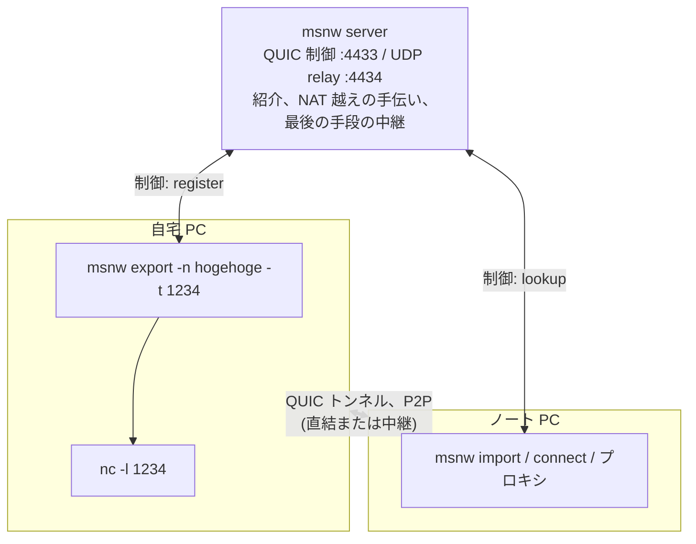
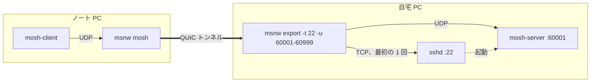
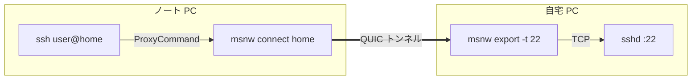
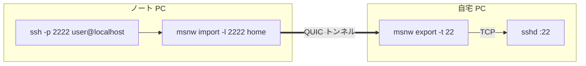
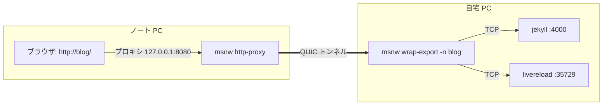
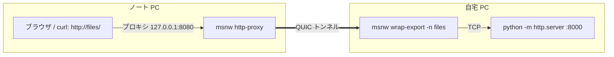

# msnw — my small network

[English](README.md)

名前でサービスを公開して、NAT の向こうから P2P で繋ぎに行く小さなトンネル。



トンネルを通る TCP 接続 1 本が QUIC ストリーム 1 本になる。

## クイックスタート

```
linuxbox> curl -L https://github.com/ikeji/mysmallnetwork/releases/latest/download/msnw-linux-amd64.tar.gz | tar xz
laptop>   curl -L https://github.com/ikeji/mysmallnetwork/releases/latest/download/msnw-linux-amd64.tar.gz | tar xz   # OS / CPU に合わせて選ぶ

linuxbox> ./msnw export -key mylonglongsecretkey -n linuxbox -t 22 -u 60001-60999     # sshd(と mosh 用 UDP)を "linuxbox" の名前で公開。キーも名前も好きに
laptop>   ./msnw mosh -key mylonglongsecretkey user@linuxbox                           # mosh で入る
laptop>   ssh -o ProxyCommand='./msnw connect -key mylonglongsecretkey linuxbox' user@linuxbox   # ssh なら

linuxbox> ./msnw wrap-export -key mylonglongsecretkey -n files -- python3 -m http.server   # コマンドを実行し、開いたポートを公開
laptop>   ./msnw http-proxy -key mylonglongsecretkey                               # 127.0.0.1:8080 の HTTP プロキシ。ブラウザに設定する
laptop>   curl -x http://127.0.0.1:8080 http://files/                              # 名前はトンネル経由で解決される
```

## インストール

[Releases](https://github.com/ikeji/mysmallnetwork/releases) から自分の OS / CPU 向けの
アーカイブを落として展開するだけ(静的バイナリ 1 つ)。Linux x86_64 なら:

```
curl -L https://github.com/ikeji/mysmallnetwork/releases/latest/download/msnw-linux-amd64.tar.gz | tar xz
./msnw -h
```

Go が入っていれば `go install github.com/ikeji/mysmallnetwork/cmd/msnw@latest` でもよい。

Android は同じ Releases ページの `msnw-android-arm64.apk` を入れる([android/README.md](android/README.md) 参照)。

## ビルド

```
make            # CGO_ENABLED=0 の静的バイナリ bin/msnw を生成(server / export / client / mosh / gen-key / version サブコマンド)
make test       # ユニットテスト + NAT シミュレーション全組み合わせ(make unit / make natsim で個別に)
make cross      # linux/darwin/windows 向けを bin/<os>-<arch>/ に生成
```

Go 1.26 以上(quic-go の要件)。`go build` を直接使うときは `CGO_ENABLED=0` を付けること。
cgo 付きでビルドすると libc を動的リンクし、古い glibc のホストで
`GLIBC_2.34' not found` のようなエラーになる。

## 使用例

どの例も、外出先のノート PC から自宅の PC に届かせる。どちらも NAT の奥にいてよく、
サーバーを用意する必要はない(公開サーバー relay.ikeji.ma を既定で使う)。共通の準備:

- 両方の PC に `msnw` バイナリを置く(「インストール」の節を参照)。PATH を通す必要はない。
- リンクキーを決めて両方で同じ文字列を使う。以下では `mylonglongsecretkey`。これを
  知っている人だけが繋がれるので、推測されにくい長いものにする(`msnw gen-key` で
  ランダムに作れる)。`-key` の代わりに環境変数 `MSNW_KEY` でも渡せる。
- `-n` の名前は好きに付けてよい。リンクキーが違えば別の名前空間なので、自分の `home` が
  他人の `home` と衝突することはない。
- exporter のログに `registered "..."` と出れば準備完了。起動したままにしておく。

### mosh



自宅 PC:

```
msnw export -key mylonglongsecretkey -n home -t 22 -u 60001-60999
```

`-t 22` が sshd、`-u 60001-60999` が mosh 用の UDP ポート範囲。範囲にしておくと mosh
セッションを何本でも同時に開ける(1 本ごとに 1 ポート使う)。

ノート PC:

```
msnw mosh -key mylonglongsecretkey user@home
```

内部では ssh(ProxyCommand に msnw 自身を指定)で `mosh-server` を起動し、mosh の UDP を
トンネルで転送して `mosh-client` を起動する。ノート PC には `ssh` と `mosh-client` が、
自宅 PC には `mosh-server` が要る。ポート範囲を変えるなら `-p 60001:60010` のように指定し、
exporter 側の `-u` も合わせる。

### ssh



自宅 PC:

```
msnw export -key mylonglongsecretkey -n home -t 22
```

ノート PC:

```
ssh -o ProxyCommand='msnw connect -key mylonglongsecretkey home' user@home
```

ホスト名 `home` は ssh の表示用で、実際の経路は ProxyCommand が作る。`~/.ssh/config` に
書いておくと `ssh home` だけで済む(`msnw mosh` もこの設定を使う):

```
Host home
    User user
    ProxyCommand /path/to/msnw connect -key mylonglongsecretkey home
```

ProxyCommand を使わず、ノート PC のローカルポートを自宅の 22 番に繋いでおく方法もある。
scp や rsync も同じ要領:



```
msnw import -key mylonglongsecretkey -l 2222 home        # 起動したままにする
ssh -p 2222 user@localhost
```

### 開発サーバー(jekyll)

開発サーバーを起動と同時に公開し、ノート PC のブラウザから名前で開く。



自宅 PC:

```
msnw wrap-export -key mylonglongsecretkey -n blog -- bundle exec jekyll serve --livereload
```

`wrap-export` はコマンドを実行し、そのコマンドが開いたポートを(ここでは 2 つとも)公開する。
いちばん小さい 4000 が既定。ビルドにかかる時間はそのまま待ち、コマンドが終われば公開も終わる。

ノート PC:

```
msnw http-proxy -key mylonglongsecretkey      # 127.0.0.1:8080 で待つ
```

ブラウザの HTTP プロキシを `127.0.0.1:8080` にして(`*.msnw` の名前だけプロキシに流すなら
[examples/msnw.pac](examples/msnw.pac))`http://blog/` を開く。ライブリロードも動く:
ページ内のスクリプトが読む `http://blog:35729/` も exporter が公開しているため。
`curl -x http://127.0.0.1:8080 http://blog/` で手早く確認できる。Firefox / Chrome の設定は
[socks5-proxy, http-proxy, proxy](#socks5-proxy-http-proxy-proxy) を参照。

### ディレクトリ(python -m http.server)

いまいるディレクトリを同じ要領で:



```
msnw wrap-export -key mylonglongsecretkey -n files -- python3 -m http.server          # 自宅 PC
msnw http-proxy -key mylonglongsecretkey                                              # ノート PC
curl -x http://127.0.0.1:8080 http://files/                                           # ノート PC
```

コマンドに `{port}` を書くと msnw が空きポートを選んで埋める:
`-- python3 -m http.server {port}`。

### 動作の見方

- 初回接続時に client のログに `via direct ...` か `via relay ...` と出る。`direct` なら
  NAT 越えの直結、`relay` ならサーバー経由(暗号化は変わらない)。
- Wi-Fi を切り替えるなどしてネットワークが変わっても、ssh も mosh も数秒止まった後に
  続きから動く(`session ... resumed` と出る)。

## 使い方(詳細)

鍵は 2 種類、どちらも共有鍵:

- **リンクキー** `-key`(`$MSNW_KEY`): exporter と client が共有する。同じでないと繋がらない。
  server は知らない。`msnw gen-key` で生成できる。
- **サーバーキー** `-server-key`(`$MSNW_SERVER_KEY`): server を勝手に使われないための入場券。
  server 側で未設定なら誰でも使える。

exporter / client は既定で公開サーバー `relay.ikeji.ma:4433`(サーバーキー無し)を使うので、
バイナリを落としてリンクキーを決めればすぐ使える。自前のサーバーを使うときは
`-s host:port`(または `$MSNW_SERVER`)で指す。

### server

```
msnw server [-server-key S] [-listen :4433] [-relay :4434] [-key server.key]
```

UDP の 2 ポートを外から到達可能にしておく。`-key` を指定すると鍵を保存して
フィンガープリントが再起動をまたいで固定される。起動時に表示される
`fingerprint: sha256:...` を exporter / client の `-server-fp`(または
`$MSNW_SERVER_FP`)に渡すとサーバーをピン留めできる。

### exporter

```
msnw export -key LINKKEY -n hogehoge -t 1234       # localhost:1234 (TCP) を hogehoge として公開
msnw export -n hogehoge -t 1234 -t 8080 -t db:5432 # 複数ターゲット。最初のものが既定
msnw export -n home -t 22 -u 60001-60999           # -t は TCP、-u は UDP。範囲も書ける(mosh 用)
msnw export -n exit --all                          # 任意の host:port へ中継(exit node 的用途)
```

`-t`(TCP)と `-u`(UDP)はそれぞれ `port`(= localhost:port)、`host:port`、または
`lo-hi` / `host:lo-hi` のポート範囲。
`--all` は両プロトコルで任意の宛先を許し、`-t` と併用するとその先頭が既定ターゲットになる。

### wrap-export

コマンドを起動し、それが待ち受けるポートを、コマンドが動いている間だけ公開する:

```
msnw wrap-export -key K -n foo -- python -m http.server        # client から http://foo/
msnw wrap-export -key K -n foo -- python -m http.server {port} # msnw が空きポートを選んで埋める
msnw wrap-export -key K -n foo -p 3000 -- npm start            # ポートが分かっている場合
```

ポートは `-p` か、コマンド中の `{port}` から決まる(`-p 0` か `-p` 無しなら空きポート)。
どちらの場合も環境変数 `PORT` でコマンドに渡す。どちらも無ければ、コマンド(と子プロセス)が
TCP で待ち受けを始めるのを `/proc` で検出して、見つかったポートを全部公開する(Linux)。
いちばん小さいポートが既定になり `http://foo/` はそこに届く(開発サーバーのライブリロード用
ポートなども `http://foo:35729/` のように使える)。既定を別のポートにしたいときは `-p` で
指定する。コマンドが終われば公開も終わり、Ctrl-C で両方止まる。

### import, connect

```
msnw connect -key LINKKEY hogehoge      # stdin/stdout をそのまま繋ぐ(nc / ssh ProxyCommand 用)
                                        # 以下 -key は $MSNW_KEY にあるものとして省略
msnw connect hogehoge:8080              # exporter 側の別ポートを指定
msnw connect exit:example.com:80        # --all な exporter 経由で任意ホストへ

msnw import -l hogehoge                 # exporter の既定ポートと同じ番号で 127.0.0.1 に listen
msnw import -l 5000 hogehoge            # 127.0.0.1:5000 → hogehoge の既定ターゲット
msnw import -l :5000 hogehoge:8080      # 全インターフェイスで listen
msnw import -l udp:60001 hogehoge:60001 # UDP を転送(送信元アドレスごとに 1 フロー)
```

### socks5-proxy, http-proxy, proxy

```
msnw socks5-proxy                       # 127.0.0.1:1080 で SOCKS5。msnw の名前はトンネル、それ以外は手元から直接
msnw http-proxy                         # 127.0.0.1:8080 で HTTP プロキシ。同じ規則(CONNECT と平文 http)
msnw proxy                              # 両方を 1 プロセスで(--socks5 addr / --http addr で変更、"" で無効)
msnw socks5-proxy -n exit :1080         # 不明なホストは exit 経由で外へ
```

プロキシ(SOCKS5 と HTTP プロキシで共通)での宛先ホストの解釈:

| 宛先ホスト               | 行き先                                    |
|--------------------------|-------------------------------------------|
| `hogehoge`               | exporter hogehoge の、宛先ポート (*)       |
| `hogehoge.msnw`          | 同上                                       |
| `db.hogehoge.msnw`       | exporter hogehoge から `db:<port>` へ      |
| それ以外(FQDN / IP)    | `-n` で指定した既定 exporter から外へ。`-n` が無ければ手元から直接接続 |

(*) 名前だけのときにブラウザが送ってくるポートは「ヒント」扱い。exporter がそのポートを
公開していればそれを使い、していなければ exporter の先頭ターゲットに繋ぐ。なので
`http://web/` は `msnw export -n web -t 8765` にも、ライブリロード用のポートも一緒に開く
開発サーバーを `wrap-export` した場合にも届く。`--all` なら全ポート公開なのでヒントが
そのまま使われる。これはプロキシ経由だけの扱いで、`-n web:80` のように明示した場合は
厳密なまま。

msnw の名前以外は手元から直接繋ぐので、ブラウザに常時設定したままで使える。
既定では 127.0.0.1 でだけ待ち受ける。`--socks5 :1080` のように他のアドレスで待ち受けると、
他のマシンからも(直接接続も含めて)使えてしまう点に注意。

`.msnw` 形式を使うときは `curl --socks5-hostname` / `ssh -o ProxyCommand='nc -X 5 -x ... %h %p'` のように
名前解決をプロキシに任せる設定にする。

例: Web サービスをブラウザで見る

サービスが動いている PC で公開し、ブラウザのある PC でプロキシを起動する:

```
msnw export -key K -n mypc -t 8765      # サービスが動いている PC
msnw socks5-proxy -key K                # ブラウザのある PC
```

あとはブラウザで `http://mypc/`(または `http://mypc.msnw/`)を開く。`mypc` は
ターゲットが 1 つなのでポートは要らない。それ以外のサイトは手元から直接繋ぐので、
プロキシは設定したままでよい。

- **Firefox**: 設定 → ネットワーク設定 → 手動でプロキシを設定、SOCKS ホスト `127.0.0.1`、
  ポート `1080`、SOCKS v5、「SOCKS v5 を使用するときは DNS もプロキシを使用する」をオン。
  最後の項目が無いと Firefox が自分で `mypc` を名前解決しようとして失敗する。
- **Chrome / Chromium / Edge**: SOCKS5 では名前解決を既定でプロキシに任せるが、設定画面に
  項目が無い。`--proxy-server="socks5://127.0.0.1:1080"` を付けて起動するか、FoxyProxy や
  SwitchyOmega のような拡張で `*.msnw` と exporter 名向けのルールを作る。
- **Safari / macOS のシステムプロキシ**: システム設定 → ネットワーク → 詳細 → プロキシ →
  SOCKS プロキシ `127.0.0.1:1080`。システムプロキシを使う全アプリに効く。
- **curl**: `curl --socks5-hostname 127.0.0.1:1080 http://mypc/`(`--socks5` だけだと
  curl が手元で名前解決して失敗する)。
- **PAC ファイル**: [examples/msnw.pac](examples/msnw.pac) は `*.msnw` とファイル内に
  列挙した名前だけをプロキシに回し、それ以外は `DIRECT` にする。プロキシを起動して
  いないときも他のサイトが見られる。ブラウザの自動プロキシ設定に
  `file:///path/to/msnw.pac` を指定する(http で配ってもよい)。Firefox も Chrome も、
  PAC で指定した SOCKS5 では手動設定と同様にプロキシ側で名前解決する。HTTP プロキシ
  だけで使うなら、ファイル内の `MSNW_PROXY` を `PROXY 127.0.0.1:8080` に変える。
- **Android**: Chrome も WebView(androidx の `ProxyController`)も SOCKS は使えないので、
  Termux で `msnw http-proxy` を動かし、Wi-Fi ネットワークのプロキシ設定を
  ホスト `127.0.0.1`、ポート `8080` にする(設定 → Wi-Fi → そのネットワーク → 詳細 →
  プロキシ: 手動)。これで Chrome から `http://mypc/` が開ける。この設定は Wi-Fi ごとで、
  モバイル回線では効かない。同じプロキシを `ProxyController` で設定する自作アプリなら
  回線を問わず効く。プロキシを使わないなら `msnw import -l 8765 mypc` で
  `http://localhost:8765/` を開く方法がどのブラウザでも使える。

例: ssh

```
ssh -o ProxyCommand='msnw connect hogehoge:22' user@anything
```

例: mosh(`msnw mosh`)

```
msnw export -key K -n home -t 22 -u 60001-60999   # sshd を既定に、mosh 用 UDP ポート範囲も許可
msnw mosh -key K user@home                      # -p で mosh のポート範囲を変えられる(既定 60001:60999)
```

`msnw mosh` は ssh(ProxyCommand に自分自身のパスを渡す)で `mosh-server` を
127.0.0.1 限定で起動し、ローカル UDP ポートを exporter 側の同じポートへ同一プロセス内で
転送してから `mosh-client` を 127.0.0.1 に向けて実行する。ssh に追加オプションを渡すには
`-ssh "..."` か `MSNW_MOSH_SSH` を使う。リンクキーは環境変数で子プロセスに渡すので
コマンドラインに出ない。フラグはホスト名の後にも書ける(`msnw mosh user@home -v`)。
mosh が端末を占有している間はログが見えないので、`-log FILE`(または `MSNW_LOG`)で
ファイルに追記する。同一プロセスの転送部分も ssh の ProxyCommand で動く子も、そこに書く。

## 仕組み

- **TCP セッションの再開**: 1 TCP 接続 = 1 QUIC ストリームだが、ストリームの上に
  再送バッファと ACK を持つ薄い層を挟み、トンネルが張り直されても TCP 接続を引き継ぐ
  (「ローミング」の節を参照)。
- **UDP**: `-l udp:PORT` で受けたデータグラムは、QUIC の datagram 拡張(RFC 9221)で運ぶ。
  1 パケットに収まらないものはフロー用ストリーム上に長さ付きで送る。フローは
  ローカルの送信元アドレスごとに 1 本で、10 分無通信で閉じる。
- **1 ソケット共用**: 各ノードは 1 つの UDP ソケットで server との制御 QUIC 接続と
  peer との直結 QUIC 接続を両方さばく。server が制御接続で観測した「外から見えるアドレス」が
  そのまま P2P で使う NAT マッピングになる(STUN 相当)。
- **紹介**: client が `-n` の名前を問い合わせると、server は exporter に client の候補
  アドレス(反射アドレス + LAN アドレス)を、client に exporter の候補を渡す。
- **ホールパンチ**: 両側が相手の全候補へ小さな UDP パケットを撃ちつつ、client が
  全候補へ並行して QUIC を dial する。最初に握手が終わったものを採用。client は
  届いたパンチの送信元アドレスも候補に加える(exporter が symmetric NAT の奥でも、
  client 側が full cone なら繋がる)。
- **リレー**: 1.5 秒経っても直結できなければ server のリレーポート経由で QUIC を張る。
  リレーは UDP をそのまま転送するだけなので、暗号化は end-to-end のまま。
  対称 NAT 同士などはここに落ちる。リレーは送信元アドレスだけでセッションを
  見分けるので、両側ともリレー経由のセッションごとに新しい UDP ソケットを使う
  (同じ exporter に複数の client がリレーで繋いでも、互いの紐付けを奪わない)。
- **パケットサイズ**: 接続は 1200 バイト(QUIC の最小値)のパケットで始める。Tailscale の
  ような MTU 1280 のリンクでも握手が通るようにするためで、その後は Path MTU
  Discovery でサイズを上げる。
- **名前空間**: exporter は名前ではなく `HMAC(リンクキー, 名前)` で登録し、client も同じ値で
  問い合わせる。server は名前も鍵も知らない。リンクキーが違えば同じ名前でも衝突しない。
- **認証**: 共有鍵の証明はすべて「その TLS セッションの keying material に対する HMAC」で、
  他の接続に再送・転用できない。server へはサーバーキーで、peer 間はリンクキーで
  QUIC 接続直後の最初のストリーム上で双方向に証明する。exporter は証明が済むまで
  CONNECT を受けず、client も済むまでデータを送らない。server から受け取った公開鍵
  フィンガープリントのピン留めも残しており、紹介されていない相手の TLS を手前で弾く。

## ネットワークが変わったとき(ローミング)

client は 2 秒ごとに「サーバーへ送るときにカーネルが選ぶ自分のアドレス」と「自分の
アドレス一覧から消えたものがないか」を見ていて、どちらかが変わったら(一時的なぶれを
除くため次の周期でも同じなら)peer 接続と server 接続を捨てて張り直す。経路の確認が
効くのは、スマホがモバイル回線を残したまま Wi-Fi につないだ場合で、このときアドレスは
何も消えず既定の経路だけが移る(しかも Android ではインターフェース一覧の取得自体が
許されていない)。また relay まで含めて全経路で接続に失敗したときも server 接続を
捨てる。server が見ている自分のアドレスが古くなっている場合がほとんどだからだ。
何も変化が見えないのに経路だけ死んだ場合(NAT のマッピングが消えた等)は、QUIC の
アイドルタイムアウト(20 秒、キープアライブ 5 秒)で検知する。exporter 側が移動した
場合も client から見るとこれにあたる。

張り直しをまたいでも TCP 接続は切れない。TCP 1 本ごとに「再開できるセッション」を
挟んでいるためで(`internal/resume`):

- CONNECT 時にトークンを発行し、両端が送受信したバイト数を数え、相手がまだ受け取ったと
  確認できていない分を再送バッファに持つ(ACK は 64 KiB ごと、または 1 秒ごと)。
- トンネルが切れても両端のローカルソケットは閉じず、client が新しい接続の上で
  `RESUME トークン 受信量` を送る。exporter は自分の受信量を返し、双方が相手の
  受け取っていない分だけ再送して続きから流す。
- 再開を 5 分待って来なければ諦めて閉じる。ssh 側からは「数秒止まって続きから動く」ように
  見える。ssh の `ServerAliveInterval` を短くしていると、その間に ssh 自身が切ることがある。

stdio(ProxyCommand)、`-l`、SOCKS5 の全モードで同じ層を使う。UDP フローは次のパケットで
張り直され、mosh はそれで数秒で復帰する。

`make roam`(`test/natsim.sh cone -- test/roam.sh`)で、セッション途中に client 側の LAN
アドレスと NAT の外側アドレスを変え、UDP フローの復旧時間と、TCP 接続の連番エコーが
欠落・重複なく続くことを確認している。古いアドレスを消す場合、古いアドレスを残して
既定の経路だけ移す場合(`ROAM_MODE=handover`、スマホの Wi-Fi 切り替え相当)、
exporter 側の拠点が移る場合(`ROAM_MODE=exporter`)の 3 回走る。実際の sshd と ssh を siteA / siteB に置いて
コマンド実行中にネットワークを変えた場合も、出力が途切れず終了コード 0 で完走する。

## セキュリティモデル

- server は信用しない。server(または偽 server)が乗っ取られてもできるのは、接続の妨害と
  「どのハッシュがいつどこから繋いだか」の観察まで。両側に別々の TLS を張って中継しようと
  しても、リンクキーの証明はセッションごとに違うので流用できない。
- リンクキーを持つ人は client にも exporter にもなれる(役割は対称)。鍵を共有した仲間内では
  名前のなりすましが可能なので、信用単位ごとに鍵を分ける。「この人はこのポートだけ」は
  鍵と exporter を分けて表現する。
- server はハッシュを見られるので、名前が推測できて鍵が短いと総当たりできる。リンクキーは
  `--gen-key` で生成したものを使う。
- server は増幅器・反射器にならないようにしてある。制御ポートは Retry で送信元を検証してから
  ハンドシェイクする(偽装した送信元には送った分より少ないバイトしか返らない)。リレーは
  hello に応答せず、紹介済みセッションの hello も制御接続で観測した IP からのものしか
  受け付けないので、偽装アドレスを転送先に登録することはできない。転送は 1 対 1。
- server 自身は外向きに接続しない。任意の宛先へ出られるのは `--all` の exporter だけで、
  それはリンクキーを持つ相手にしか使えない。
- 失効は鍵の配り直し。
- 1 プロセス 1 リンクキー。SOCKS5 モードで鍵の違う exporter 群をまたぐ必要が出たら、
  優先度付きの複数鍵に拡張する(client 側は名前ごとに鍵を引く構造にしてある)。

## NAT 越えのテスト(test/natsim.sh)

Linux のネットワーク名前空間で「公開サーバー + NAT の奥の拠点 2 つ」を作り、
本物のホールパンチとリレーフォールバックを検証する。sudo 不要(user namespace で動く。
uid は root ではなく自分のままマップし、`unshare --keep-caps` で capability だけ保つ)。
`nft`(パッケージ `nftables`)と `iproute2` が必要。

```
make
test/natsim.sh cone        # 一般的なルータ相当。直結を期待
test/natsim.sh symmetric   # ポートが宛先ごとに変わる NAT。リレーを期待
test/natsim.sh fullcone    # 送信元を問わず受け付ける NAT(UPnP でポートを開けた状態相当)
test/natsim.sh cone:symmetric   # 片側ずつ指定(siteA:siteB)
test/natsim.sh cone -- bash   # 構築だけして中でシェルを開く(ip netns exec siteA ... 等)
NATSIM_OPEN_INPUT=1 test/natsim.sh cone   # WAN 側 INPUT を落とさない NAT(下記)
```

構成: `siteA 192.168.1.10 ─ natA(10.0.0.2) ─ br0 ─ natB(10.0.0.3) ─ siteB 192.168.2.10`、
サーバーは 10.0.0.1。exporter が siteA、client が siteB で動く。

分かっていること:

- cone(masquerade)+ WAN 側で未承諾パケットを INPUT で drop する普通のルータ同士なら直結する。
- symmetric(`masquerade fully-random`)は直結できずリレーになる。cone と symmetric の
  混合(どちらの向きでも)も同様にリレーになる。Linux の masquerade はフィルタが
  address+port 依存(port-restricted cone)なので、symmetric 側の新しいポートを
  cone 側が受け付けられない。
- full cone が片側にあれば、相手が symmetric でも直結できる。exporter が symmetric で
  client が full cone の場合、server が見た exporter のポートは使えないが、exporter の
  パンチが client に届くので、client はその送信元アドレスを候補として学習して dial する。
  full cone は masquerade では作れないので、シミュレータでは対象ポートへの静的 DNAT で
  代用している(siteA は UDP 40001、siteB は 40002 を `-port` で固定)。

| siteA(exporter) : siteB(client) | 結果 |
|---|---|
| cone : cone | 直結 |
| fullcone : cone / cone : fullcone / fullcone : fullcone | 直結 |
| fullcone : symmetric | 直結 |
| symmetric : fullcone | 直結(パンチから学習した候補) |
| cone : symmetric / symmetric : cone / symmetric : symmetric | リレー |
- WAN 側 INPUT を drop しない NAT 同士では、相手のパンチが先に届くと conntrack に
  受信フローとして残り、自分の送信フローに同じポートを再利用してもらえなくなる
  (mapping が endpoint-independent でなくなる)。両側が同時にパンチする以上これは
  避けられず、リレーに落ちる。

## Android アプリ

`android/` に、ブラウザタブ(HTTP プロキシ経由)と、公開したホストへ本物の mosh で繋ぐ
端末タブを持つアプリがある。msnw は無改造のまま、NDK でビルドした `mosh-client` と
dropbear を同梱している。[android/README.md](android/README.md) を参照。

## 注意

- 既定では server 証明書を検証しない。偽 server に繋がれても peer 間は繋がらないだけで
  漏れるものは無いが、妨害を避けたいなら server を `-key` で鍵固定し `-server-fp` でピン留めする。
- Linux で UDP 受信バッファが小さいと quic-go が警告する。高スループットが要るなら
  `sysctl -w net.core.rmem_max=7500000 net.core.wmem_max=7500000`。
- デバッグ用に `MSNW_FORCE_RELAY=1` で client を直結せずリレーのみにできる。
  `-v` で dial の失敗理由を表示。
- `msnw version` でビルドのバージョンを表示する。peer 同士と server はバージョンを交換し、
  違っていればログとエラーに `... (exporter v0.1.4, this client v0.1.5)` のように両方を出す。
  バージョンを送ってこない古い相手は `unknown` と表示される。
