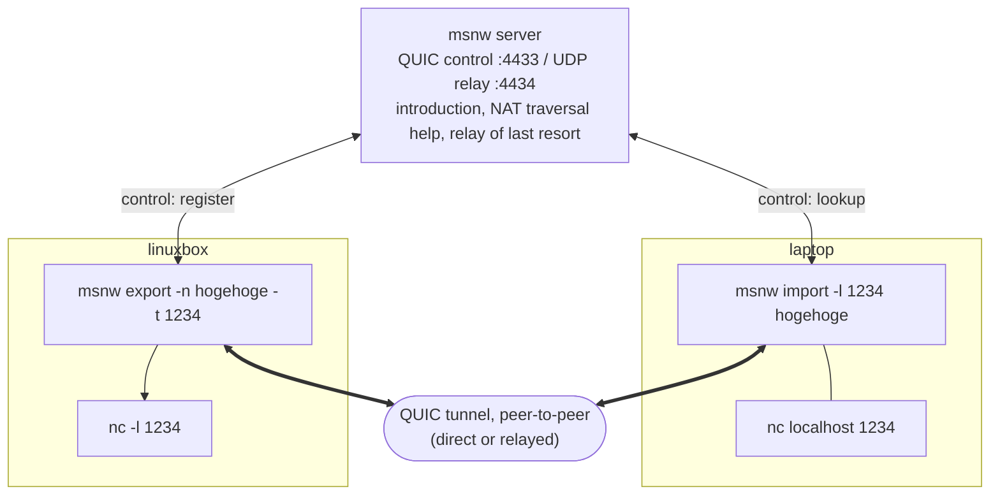
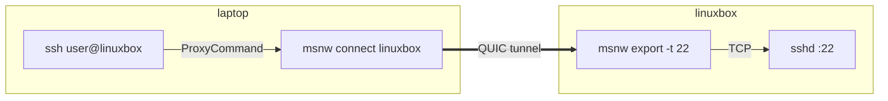
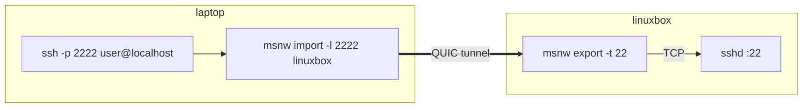
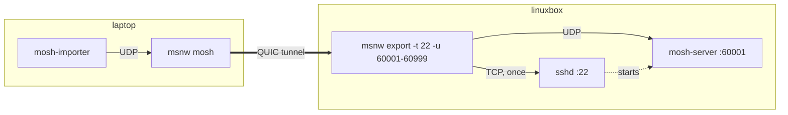
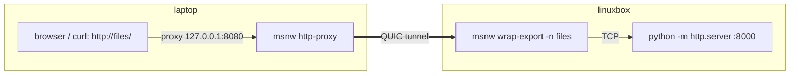
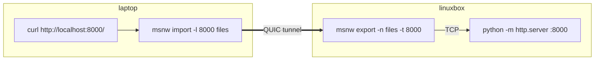
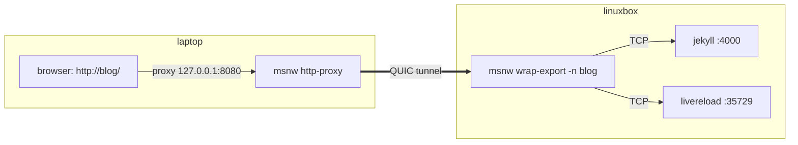

# msnw — my small network

[日本語](README.ja.md)

A small tunnel: publish a service under a name, and reach it peer-to-peer
from behind NAT.



One TCP connection through the tunnel is one QUIC stream.

## Quick start

```
linuxbox> curl -L https://github.com/ikeji/mysmallnetwork/releases/latest/download/msnw-linux-amd64.tar.gz | tar xz
laptop>   curl -L https://github.com/ikeji/mysmallnetwork/releases/latest/download/msnw-linux-amd64.tar.gz | tar xz   # pick your OS / CPU

linuxbox> ./msnw export -key mylonglongsecretkey -n linuxbox -t 22 -u 60001-60999     # publish sshd (+ UDP ports for mosh) under the name "linuxbox"; any key, any name
laptop>   ssh -o ProxyCommand='./msnw connect -key mylonglongsecretkey linuxbox' user@linuxbox   # ssh in
laptop>   ./msnw mosh -key mylonglongsecretkey user@linuxbox                           # or mosh

linuxbox> ./msnw wrap-export -key mylonglongsecretkey -n files -- python3 -m http.server   # run a command and publish the port it opens
laptop>   ./msnw http-proxy -key mylonglongsecretkey                               # HTTP proxy on 127.0.0.1:8080; set it in the browser
laptop>   curl -x http://127.0.0.1:8080 http://files/                              # names resolve through the tunnel
```

## Install

Download the archive for your OS / CPU from
[Releases](https://github.com/ikeji/mysmallnetwork/releases) and unpack it: it
is a single static binary. On Linux x86_64:

```
curl -L https://github.com/ikeji/mysmallnetwork/releases/latest/download/msnw-linux-amd64.tar.gz | tar xz
./msnw -h
```

With Go installed, `go install github.com/ikeji/mysmallnetwork/cmd/msnw@latest` works too.

Android: install `msnw-android-arm64.apk` from the same Releases page (see
[android/README.md](android/README.md)).

## Build

```
make            # static binary bin/msnw (CGO_ENABLED=0) with the server, export, wrap-export, import, connect, socks5-proxy, http-proxy, proxy, mosh, gen-key, version subcommands
make test       # unit tests + the full NAT simulation matrix (make unit / make natsim / make roam individually)
make cross      # linux/darwin/windows builds into bin/<os>-<arch>/
```

Needs Go 1.26 or newer (a quic-go requirement). If you run `go build` yourself,
set `CGO_ENABLED=0`: a cgo build links libc dynamically and fails on hosts
with an older glibc (`GLIBC_2.34' not found`).

## Examples

Each example reaches a Linux box at linuxbox (`linuxbox`) from a laptop on the road. Both can sit
behind NAT, and you do not need to run a server: the public server
relay.ikeji.ma is the default. In every case:

- Put the `msnw` binary on both machines (see [Install](#install)). It does
  not have to be on PATH.
- Pick a link key and use the same string on both sides; below it is
  `mylonglongsecretkey`. Only people who know it can connect, so make it long
  and hard to guess (`msnw gen-key` prints a random one). It can also come
  from the `MSNW_KEY` environment variable instead of `-key`.
- The name after `-n` is anything you like. A different link key is a
  different namespace, so your `linuxbox` never collides with someone else's.
- Once the exporter logs `registered "..."` it is ready. Leave it running.

### ssh



linuxbox:

```
msnw export -key mylonglongsecretkey -n linuxbox -t 22
```

laptop:

```
ssh -o ProxyCommand='msnw connect -key mylonglongsecretkey linuxbox' user@linuxbox
```

The host name `linuxbox` is only what ssh displays; the ProxyCommand makes the
actual path. Put it in `~/.ssh/config` and `ssh linuxbox` is enough (`msnw mosh`
uses the same entry):

```
Host linuxbox
    User user
    ProxyCommand /path/to/msnw connect -key mylonglongsecretkey linuxbox
```

scp and rsync use the same entry: `scp file linuxbox:` just works.

Without a ProxyCommand, keep a local port connected to port 22 on linuxbox
instead:



```
msnw import -key mylonglongsecretkey -l 2222 linuxbox        # leave it running
ssh -p 2222 user@localhost
```

### mosh



linuxbox:

```
msnw export -key mylonglongsecretkey -n linuxbox -t 22 -u 60001-60999
```

`-t 22` is sshd, `-u 60001-60999` is the UDP port range for mosh. A range
lets you open any number of mosh sessions at once (each uses one port).

laptop:

```
msnw mosh -key mylonglongsecretkey user@linuxbox
```

Internally it starts `mosh-server` over ssh (with msnw itself as the
ProxyCommand), forwards mosh's UDP through the tunnel and runs `mosh-importer`.
The laptop needs `ssh` and `mosh-importer`, the linuxbox PC needs `mosh-server`. To
use another port range pass `-p 60001:60010` and match the exporter's `-u`.

### A directory (python -m http.server)

Publish the directory you are in, and browse it from the laptop by name.



```
linuxbox> msnw wrap-export -key mylonglongsecretkey -n files -- python3 -m http.server
laptop>   msnw http-proxy -key mylonglongsecretkey
laptop>   curl -x http://127.0.0.1:8080 http://files/
```

Without `{port}` in the command, msnw watches the command and publishes the
port it opens. With `{port}` msnw picks a free port and fills it in:
`-- python3 -m http.server {port}`.

The same without a proxy, with `export` and `import`: the server's port is
published, and the laptop keeps a local port connected to it.



```
linuxbox> python3 -m http.server                                  # in one terminal
linuxbox> msnw export -key mylonglongsecretkey -n files -t 8000   # in another
laptop>   msnw import -key mylonglongsecretkey -l 8000 files
laptop>   curl http://localhost:8000/
```

### A dev server (jekyll)

The same with a dev server, published as it starts:



linuxbox:

```
msnw wrap-export -key mylonglongsecretkey -n blog -- bundle exec jekyll serve --livereload
```

`wrap-export` runs the command and publishes the ports it opens (both here);
the lowest one, 4000, is the default. It waits as long as the build takes and
stops exporting when the command exits.

laptop:

```
msnw http-proxy -key mylonglongsecretkey      # listens on 127.0.0.1:8080
```

Point the browser's HTTP proxy at `127.0.0.1:8080` (or use
[examples/msnw.pac](examples/msnw.pac) so only `*.msnw` names go through it)
and open `http://blog/`. Live reload works too: the page's script loads
`http://blog:35729/`, which the exporter also publishes. `curl -x
http://127.0.0.1:8080 http://blog/` is a quick check. See
[socks5-proxy, http-proxy, proxy](#socks5-proxy-http-proxy-proxy) for Firefox
and Chrome settings.

### What to look for

- On the first connection the importer logs `via direct ...` or `via relay ...`.
  `direct` means the NAT traversal worked; `relay` means the server is
  forwarding packets (encryption is the same either way).
- When the network changes (switching Wi-Fi, for example), both ssh and mosh
  pause for a few seconds and then carry on where they were (the log says
  `session ... resumed`).

## Usage in detail

There are two keys, both shared secrets:

- **Link key** `-key` (`$MSNW_KEY`): shared between exporter and importer; they
  only connect if it matches. The server never sees it. `msnw gen-key` makes one.
- **Server key** `-server-key` (`$MSNW_SERVER_KEY`): an admission ticket that
  keeps strangers off your server. If the server is started without one,
  anyone may use it.

Exporter and importer default to the public server `relay.ikeji.ma:4433` (no
server key), so a downloaded binary plus a link key is all you need. To use
your own server, point at it with `-s host:port` (or `$MSNW_SERVER`).

### server

```
msnw server [-server-key S] [-listen :4433] [-relay :4434] [-key server.key]
```

Both UDP ports must be reachable from outside. With `-key` the private key is
saved so the fingerprint stays the same across restarts; the
`fingerprint: sha256:...` printed at startup can be pinned by exporter and
importer with `-server-fp` (or `$MSNW_SERVER_FP`).

### export

```
msnw export -key LINKKEY -n hogehoge -t 1234       # publish localhost:1234 (TCP) as hogehoge
msnw export -n hogehoge -t 1234 -t 8080 -t db:5432 # several targets; the first is the default
msnw export -n home -t 22 -u 60001-60999           # -t is TCP, -u is UDP; ranges allowed (mosh)
msnw export -n exit --all                          # forward to any host:port (exit-node style)
```

`-t` (TCP) and `-u` (UDP) take `port` (meaning localhost:port), `host:port`, or
a range `lo-hi` / `host:lo-hi`. `--all` allows any destination on both
protocols; combined with `-t`, the first `-t` is the default target.

### wrap-export

Run a command and publish the port it listens on, for as long as it runs:

```
msnw wrap-export -key K -n foo -- python -m http.server        # then http://foo/ from a importer
msnw wrap-export -key K -n foo -- python -m http.server {port} # msnw picks a free port and fills it in
msnw wrap-export -key K -n foo -p 3000 -- npm start            # the port is known
```

The port is taken from `-p`, or from a `{port}` placeholder in the command
(`-p 0` or no `-p` picks a free port); either way it is also exported to the
command as `$PORT`. With neither, msnw watches the command and its children
for listening TCP sockets (Linux, via /proc) and publishes all of them, the
lowest port being the default that `http://foo/` reaches (a dev server's
live-reload port, for instance, is still available as `http://foo:35729/`).
Use `-p` when the default should be another port. The export ends when the
command exits, and Ctrl-C stops both.

### import, connect

```
msnw connect -key LINKKEY hogehoge      # pipe stdin/stdout (nc style, ssh ProxyCommand)
                                        # below, -key is assumed to be in $MSNW_KEY
msnw connect hogehoge:8080              # another port on the exporter
msnw connect exit:example.com:80        # any host through an --all exporter

msnw import -l hogehoge                 # listen on 127.0.0.1 on the exporter's default port number
msnw import -l 5000 hogehoge            # 127.0.0.1:5000 -> hogehoge's default target
msnw import -l :5000 hogehoge:8080      # listen on all interfaces
msnw import -l udp:60001 hogehoge:60001 # forward UDP (one flow per source address)
```

### socks5-proxy, http-proxy, proxy

```
msnw socks5-proxy                       # SOCKS5 on 127.0.0.1:1080; msnw names go through the tunnel, the rest directly
msnw http-proxy                         # HTTP proxy on 127.0.0.1:8080 with the same rules (CONNECT + plain http)
msnw proxy                              # both in one process (--socks5 addr / --http addr to change or "" to disable)
msnw socks5-proxy -n exit :1080         # unknown hosts go out through exit
```

How proxy destinations (SOCKS5 and HTTP proxy alike) are interpreted:

| destination host        | goes to                                      |
|-------------------------|----------------------------------------------|
| `hogehoge`              | exporter hogehoge, the requested port (*)    |
| `hogehoge.msnw`         | same                                         |
| `db.hogehoge.msnw`      | `db:<port>` as seen from exporter hogehoge   |
| anything else (FQDN/IP) | the default exporter given with `-n`; without `-n`, a direct connection from this machine |

(*) The port a browser sends for a bare name is only a hint: if the exporter
publishes that port it is used, otherwise the exporter's first target is, so
`http://web/` reaches `msnw export -n web -t 8765` and `wrap-export` of a dev
server that also opens a live-reload port. With `--all` every port is
exported and the hint always wins. This only applies to the proxies; an
explicit `-n web:80` stays strict.

Because everything else is reached directly, the proxy can stay configured in
a browser all the time. It listens on 127.0.0.1 by default; binding another
address (`--socks5 :1080`) lets other machines use it, direct connections
included.

For the `.msnw` forms let the proxy resolve names, e.g. `curl --socks5-hostname`
or `ssh -o ProxyCommand='nc -X 5 -x ... %h %p'`.

Example: a web service in the browser

Publish it on the machine that runs it, and start the proxy on the machine
with the browser:

```
msnw export -key K -n mypc -t 8765      # the service runs on this machine
msnw socks5-proxy -key K                # on the machine with the browser
```

Then point the browser at `http://mypc/` (or `http://mypc.msnw/`). Because
`mypc` publishes a single target, the port is not needed. Every other site is
reached directly, so the proxy can stay on all the time.

- **Firefox**: Settings → Network Settings → Manual proxy configuration, SOCKS
  Host `127.0.0.1`, Port `1080`, SOCKS v5, and tick "Proxy DNS when using SOCKS
  v5". Without that last option Firefox tries to resolve `mypc` itself and
  fails.
- **Chrome / Chromium / Edge**: SOCKS5 sends names through the proxy by
  default, but the setting is not in the UI; start the browser with
  `--proxy-server="socks5://127.0.0.1:1080"`, or use an extension such as
  FoxyProxy / SwitchyOmega and add a rule for `*.msnw` and your exporter names.
- **Safari / macOS system proxy**: System Settings → Network → Details →
  Proxies → SOCKS proxy `127.0.0.1:1080`. This applies to every app that uses
  the system proxy.
- **curl**: `curl --socks5-hostname 127.0.0.1:1080 http://mypc/` (with plain
  `--socks5` curl resolves the name locally and fails).
- **PAC file**: [examples/msnw.pac](examples/msnw.pac) sends `*.msnw` and the
  names listed in it to the proxy and everything else `DIRECT`, so other
  sites keep working even while the proxy is not running. Point the browser's
  automatic proxy configuration at it (`file:///path/to/msnw.pac`, or serve it
  over http). Firefox and Chrome honour the SOCKS5 name resolution from a PAC
  as they do for a manual SOCKS5 setting. For an HTTP-proxy-only client,
  change `MSNW_PROXY` in the file to `PROXY 127.0.0.1:8080`.
- **Android**: neither Chrome nor WebView (androidx `ProxyController`) can use
  SOCKS, so run `msnw http-proxy` in Termux and set the Wi-Fi
  network's proxy to host `127.0.0.1`, port `8080` (Settings → Wi-Fi → the
  network → Advanced → Proxy: Manual). Chrome then opens `http://mypc/`. The
  setting is per Wi-Fi network and does not apply on mobile data; an app that
  sets the same proxy through `ProxyController` works on any network. Without
  a proxy at all, `msnw import -l 8765 mypc` and `http://localhost:8765/`
  work in every browser.

Example: ssh

```
ssh -o ProxyCommand='msnw connect hogehoge:22' user@anything
```

Example: mosh (`msnw mosh`)

```
msnw export -key K -n home -t 22 -u 60001-60999   # sshd as the default target, plus mosh's UDP range
msnw mosh -key K user@home                      # -p changes the port range (default 60001:60999)
```

`msnw mosh` starts `mosh-server` over ssh (passing its own executable as the
ProxyCommand) bound to 127.0.0.1 only, forwards a local UDP port to the same
port on the exporter side inside the same process, then runs `mosh-importer`
against 127.0.0.1. Extra ssh options go in `-ssh "..."` or `MSNW_MOSH_SSH`. The
link key reaches the child process through the environment, not the command
line. Flags may follow the host (`msnw mosh user@home -v`). While mosh owns
the terminal, log output is invisible, so use `-log FILE` (or `MSNW_LOG`) to
append it to a file; both the in-process forwarder and the ssh ProxyCommand
child log there.

## How it works

- **Resumable TCP sessions**: one TCP connection is one QUIC stream, but a thin
  layer on top of the stream keeps a replay buffer and ACKs, so a TCP
  connection survives the tunnel being re-established (see "Roaming").
- **UDP**: datagrams received on `-l udp:PORT` travel as QUIC datagrams
  (RFC 9221). Anything too large for one packet goes length-framed over the
  flow's own stream. There is one flow per local source address; it closes
  after 10 minutes of silence.
- **One socket**: each node uses a single UDP socket both for the control
  connection to the server and for direct peer connections, so the public
  address the server observes on the control connection is exactly the NAT
  mapping the peers punch through (STUN-like).
- **Introduction**: when the importer looks up the name given with `-n`, the
  server hands the exporter the importer's candidate addresses (reflexive plus
  LAN) and the importer the exporter's.
- **Hole punching**: both sides send small UDP packets to all of the other's
  candidates while the importer dials QUIC to all of them in parallel; the first
  handshake to finish wins. The importer also treats the source address of any
  punch it receives as a candidate, so an exporter behind a symmetric NAT is
  still reachable when the importer side is a full cone.
- **Relay**: if no direct connection is up after 1.5 seconds, QUIC is set up
  through the server's relay port. The relay forwards UDP verbatim, so
  encryption stays end-to-end. Symmetric-to-symmetric NATs end up here.
  The relay tells sessions apart by source address only, so both sides use a
  fresh UDP socket for every relayed session; several importers can then share
  one exporter through the relay without taking over each other's binding.
- **Packet size**: connections start with 1200-byte QUIC packets (the protocol
  minimum) so that the handshake also fits through 1280-byte-MTU links such as
  Tailscale; path MTU discovery raises the size afterwards.
- **Namespaces**: the exporter registers `HMAC(link key, name)` rather than the
  name, and the importer looks up the same value. The server learns neither the
  name nor the key, and different keys never collide even for the same name.
- **Authentication**: every proof of a shared key is an HMAC over that TLS
  session's exported keying material, so it cannot be replayed or forwarded to
  another connection. The server key is proven to the server; the link key is
  proven in both directions on the first stream of every peer connection. The
  exporter accepts no CONNECT and the importer sends no data before that. The
  public-key fingerprints exchanged through the server are still pinned, which
  rejects TLS from anyone the server did not introduce.

## Roaming (when the network changes)

Every 2 seconds the importer checks which local address the kernel would use to
reach the server and whether any local address has disappeared. When either
changes (confirmed on the next tick, to ride out flaps) it drops its peer and
server connections and redials. The route check is what catches a phone
joining Wi-Fi while mobile data is still up: no address goes away, only the
default network moves, and on Android listing interfaces is not allowed
anyway. If a dial fails on every path, relay included, the importer also drops
its server connection, since that usually means the server's view of its
address is stale. If the path dies without any visible change (a NAT mapping
expired, say, or the exporter moved), the QUIC idle timeout catches it (20
seconds, keepalive every 5).

TCP connections survive the redial thanks to the resumable session layer
(`internal/resume`):

- CONNECT issues a token. Both ends count the payload bytes they sent and
  received and keep whatever the peer has not acknowledged in a replay buffer
  (ACKs every 64 KiB or every second).
- When the tunnel breaks, neither end closes its local socket. The importer sends
  `RESUME <token> <received>` on a fresh connection, the exporter answers with
  its own count, and each side retransmits only what the other missed.
- A session that waits more than 5 minutes for a resume is closed. To ssh this
  looks like a pause of a few seconds. A short `ServerAliveInterval` in ssh can
  make ssh itself give up during that pause.

stdio (ProxyCommand), `-l` and SOCKS5 all use the same layer. UDP flows are
recreated on the next packet, which is how mosh comes back within seconds.

`make roam` (`test/natsim.sh cone -- test/roam.sh`) changes the importer site's
LAN address and NAT WAN address mid-session and checks the UDP recovery time
and that a numbered TCP echo continues without loss or duplication. It runs
three times: with the old address removed, with the old address kept and only
the default route moved (`ROAM_MODE=handover`, like a phone switching to
Wi-Fi), and with the exporter's site moving instead (`ROAM_MODE=exporter`). A real sshd
and ssh placed in siteA / siteB, with the network changed during a running
command, finish with all output and exit code 0.

## Security model

- The server is not trusted. A compromised (or impersonated) server can only
  disrupt connections and observe which hashes connected when and from where.
  Terminating TLS on both sides and forwarding does not work: the link-key
  proof is different for every session.
- Whoever holds the link key can be either importer or exporter (the roles are
  symmetric), so within a group sharing a key, names can be spoofed. Use one key
  per trust boundary; "this person only gets this port" is expressed with a
  separate key and exporter.
- The server sees the name hashes, so a guessable name with a short key can be
  brute-forced. Use keys from `msnw gen-key`.
- The server is neither an amplifier nor a reflector. The control port
  validates the source address with a Retry before the handshake (a spoofed
  source gets back fewer bytes than it sent). The relay never answers hellos,
  and accepts a session's hello only from the IP seen on that party's control
  connection, so a spoofed address cannot be bound as a relay endpoint.
  Forwarding is one to one.
- The server never opens outbound connections. Only an `--all` exporter can
  reach arbitrary destinations, and only for holders of its link key.
- Revocation means handing out a new key.
- One link key per process. If SOCKS5 ever needs to span exporters with
  different keys, this extends to a prioritized list (the importer already looks
  keys up per name).

## NAT traversal tests (test/natsim.sh)

Builds "a public server plus two sites behind NAT" out of Linux network
namespaces and exercises real hole punching and the relay fallback. No sudo
needed: it runs in a user namespace (mapped to your own uid, not root, keeping
only the capabilities via `unshare --keep-caps`). Needs `nft` (package
`nftables`) and `iproute2`.

```
make
test/natsim.sh cone        # a typical router; expects a direct connection
test/natsim.sh symmetric   # ports change per destination; expects the relay
test/natsim.sh fullcone    # accepts from any source (like a UPnP port mapping)
test/natsim.sh cone:symmetric   # one type per side (siteA:siteB)
test/natsim.sh cone -- bash   # just build the topology and open a shell (ip netns exec siteA ...)
NATSIM_OPEN_INPUT=1 test/natsim.sh cone   # a NAT that does not drop unsolicited WAN input (see below)
```

Topology: `siteA 192.168.1.10 ─ natA(10.0.0.2) ─ br0 ─ natB(10.0.0.3) ─ siteB 192.168.2.10`,
server at 10.0.0.1. The exporter runs in siteA, the importer in siteB.

Findings:

- Two ordinary routers (cone masquerade that drops unsolicited packets in the
  WAN INPUT chain) connect directly.
- Symmetric (`masquerade fully-random`) cannot connect directly and uses the
  relay, and so does any cone/symmetric mix in either direction: Linux
  masquerade filters by address and port (port-restricted cone), so the cone
  side rejects the symmetric side's new port.
- A full cone on either side makes a direct connection possible even against a
  symmetric peer. With a symmetric exporter and a full-cone importer, the port the
  server saw for the exporter is useless, but the exporter's punch reaches the
  importer, which learns the source address and dials it. Masquerade cannot make
  a full cone, so the simulator uses a static DNAT of the node's port instead
  (siteA pins UDP 40001 and siteB 40002 with `-port`).

| siteA (exporter) : siteB (importer) | result |
|---|---|
| cone : cone | direct |
| fullcone : cone / cone : fullcone / fullcone : fullcone | direct |
| fullcone : symmetric | direct |
| symmetric : fullcone | direct (candidate learned from the punch) |
| cone : symmetric / symmetric : cone / symmetric : symmetric | relay |

- Between two NATs that do not drop unsolicited WAN input, a punch that arrives
  first is recorded by conntrack as an inbound flow, after which the NAT will
  not reuse the same port for its own outbound flow (the mapping stops being
  endpoint-independent). With both sides punching at once this cannot be
  avoided, so those fall back to the relay.

## Android app

`android/` holds an app with a browser tab (through the HTTP proxy) and a
terminal tab running real mosh to a published host; msnw is bundled unchanged
together with `mosh-importer` and dropbear built with the NDK. See
[android/README.md](android/README.md).

## Notes

- The server certificate is not verified by default. Landing on a fake server
  leaks nothing (the peers just fail to connect), but to rule out disruption,
  pin the server with `-key` on the server side and `-server-fp` on the nodes.
- On Linux, quic-go warns when the UDP receive buffer is small. For high
  throughput: `sysctl -w net.core.rmem_max=7500000 net.core.wmem_max=7500000`.
- For debugging, `MSNW_FORCE_RELAY=1` makes the importer skip direct paths and
  use only the relay; `-v` shows why each dial failed.
- `msnw version` prints the build version. Peers and the server exchange their
  versions; when they differ, logs and error messages say so, e.g.
  `... (exporter v0.1.4, this importer v0.1.5)`. A peer too old to send a
  version shows as `unknown`.
